<!-- ─────────────────────────────  HEADER  ───────────────────────────── -->

  &nbsp;
  &nbsp;
  

 

**I build software that runs businesses — and I own it end-to-end.**

From modern web platforms and cross-platform mobile apps to the EDI pipelines and enterprise systems that quietly move millions in orders every day. Ten years in production environments taught me one thing: shipping is easy, *operating* is the craft. That's why everything I deliver comes with clean architecture, automated deployment, monitoring — and full ownership for you. No agencies, no middlemen, no lock-in.

 

<!-- ─────────────────────────────  FEATURED  ───────────────────────────── -->

  <b>Live:</b> <a href="https://myrebar.de">myrebar.de</a> &nbsp;·&nbsp; <a href="https://myrebar.app">myrebar.app</a> &nbsp;·&nbsp; pnpm + Turborepo monorepo — Next.js web · NestJS + Prisma API · React Native app · React admin — running on dedicated German infrastructure

 

Rebar is not a portfolio demo. It is a **complete product I designed, built and operate alone** — database schema to App Store release, payment flow to GDPR paperwork. If you want to know how I work, this is the answer: one person, production quality, full stack, full responsibility.

 

<!-- ─────────────────────────────  SERVICES  ───────────────────────────── -->
## What I build for clients

| | Service | What you get |
| :---: | :--- | :--- |
| **01** | **Websites** | Fast, responsive, SEO-optimized business websites — built to convert, not just to exist |
| **02** | **Online Shops** | E-commerce done right — Shopify where it fits, fully custom where it matters |
| **03** | **Mobile Apps** | One codebase, both stores — React Native apps for iOS & Android |
| **04** | **EDI & Automation** | EDIFACT, API integrations, process automation — the invisible systems that save real money |
| **05** | **Enterprise Systems** | Large-scale backends, dashboards, data pipelines — engineered for the long run |

  Free initial consultation · direct line to the developer · everything belongs to you — domain, hosting, code

 

<!-- ─────────────────────────────  STACK  ───────────────────────────── -->

 
 

<!-- ─────────────────────────────  ANALYTICS  ───────────────────────────── -->
## GitHub Analytics

  
  

  

  Most of my production code lives in <b>private enterprise repositories</b> — the numbers above are the tip of the iceberg. Visit <a href="https://omidamini.de">omidamini.de</a> for the full picture.

 

<!-- ─────────────────────────────  CTA  ───────────────────────────── -->

  📍 Düsseldorf, Germany &nbsp;·&nbsp; 🌐 <a href="https://omidamini.de">omidamini.de</a> &nbsp;·&nbsp; 📧 <a href="mailto:aminiomid1994@gmail.com">aminiomid1994@gmail.com</a> &nbsp;·&nbsp; 💼 <a href="https://linkedin.com/in/iomid23">LinkedIn</a>

