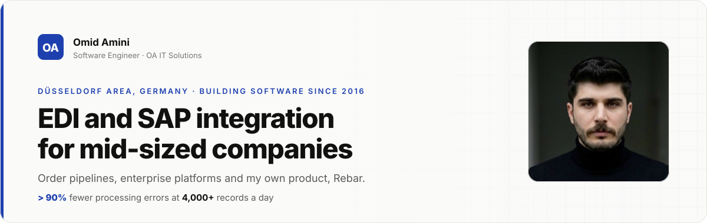
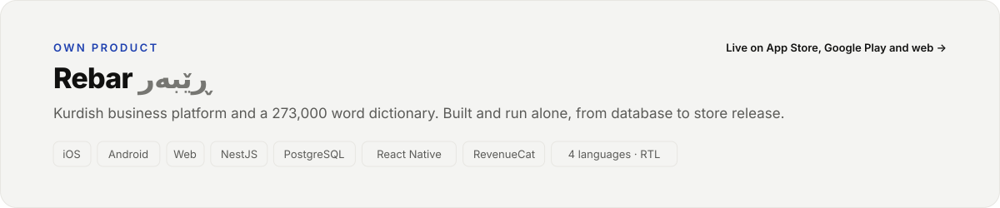

<a href="https://omidamini.de">
  <picture>
    <source media="(prefers-color-scheme: dark)" srcset="./assets/header-dark.svg" />
    
  </picture>
</a>

  <a href="https://omidamini.de/en"><b>omidamini.de</b></a>
  &nbsp;·&nbsp;
  <a href="https://www.linkedin.com/in/iomid23">LinkedIn</a>
  &nbsp;·&nbsp;
  <a href="mailto:contact@omidamini.de">contact@omidamini.de</a>
  &nbsp;·&nbsp;
  <a href="https://omidamini.de/edi-sap-integration">EDI &amp; SAP (German)</a>

I'm Omid, a software engineer in the Düsseldorf area. At nobilia I own the EDI processing of more than 4,000 orders a day and connect it to SAP. Through my own business, **OA IT Solutions**, I take on selected client projects, and since 2023 I have been building my own startup, **Rebar**, live on the App Store and Google Play since August 2026.

Most of my work lives in private repositories, so this page is the short version. The long one, with case studies, is on [omidamini.de](https://omidamini.de/en).

## Selected work

| Project | What it is | Outcome |
| :-- | :-- | :-- |
| [**Order automation**](https://omidamini.de/en/projects/enterprise-order-automation) | Rebuilt the order processing of an industrial company as one pipeline: EDIFACT intake, validation, mapping, handover to SAP via REST, monitoring. C, C#, PowerShell, Oracle. | Over 90% fewer processing errors at more than 4,000 records a day |
| [**Prime Route Logistics**](https://pr-logistics.net) | Website, client portal and full forwarding ERP for an international freight forwarder: quotes, tracking, customs documents, invoicing. Four languages including RTL. | One system for sales, operations and billing |
| [**Rebar**](https://omidamini.de/en/projects/rebar) | My own startup since 2023. Business directory, bookings, subscriptions and a Kurdish dictionary with 273,000 entries from 19 sources. | Live on the App Store and Google Play since August 2026 |
| **Tapsi**, authentication | Complete sign-in and session system, with tests, for a ride-hailing platform with very high traffic. | In production under heavy load |
| **Sarafi**, admin platform | Admin and staff dashboards for a trading platform, with role-based access and real-time reporting. | In production with clearly separated roles |

<a href="https://omidamini.de/en/projects/rebar">
  <picture>
    <source media="(prefers-color-scheme: dark)" srcset="./assets/rebar-dark.svg" />
    
  </picture>
</a>

## How I work

- **One person, start to finish.** You talk to whoever writes the code, from the first call to the handover.
- **Validated at every step.** Integrations get checks, clear error paths and monitoring, so problems show up before your customer calls.
- **It belongs to you.** Domain, hosting and database can run in your name, and the code is documented so another developer can pick it up.
- **Fixed prices.** Free first call, then a binding offer.

## Tools I use

**Integration** &nbsp; EDIFACT · AS2 / SFTP · SAP (IDoc, REST) · Oracle · PL/SQL · C · C# · PowerShell 
**Web and backend** &nbsp; TypeScript · Next.js · React · Node.js · NestJS · PostgreSQL · Prisma · Redis 
**Mobile** &nbsp; React Native · Expo · EAS · RevenueCat 
**Operations** &nbsp; Docker · Hetzner · Vercel · Cloudflare · GitHub Actions · Sentry

 

<a href="https://omidamini.de/en#contact">
  <picture>
    <source media="(prefers-color-scheme: dark)" srcset="./assets/contact-dark.svg" />
    
  </picture>
</a>

Düsseldorf area, Germany · working remotely across Germany and Europe · German, English, Kurdish, Persian

